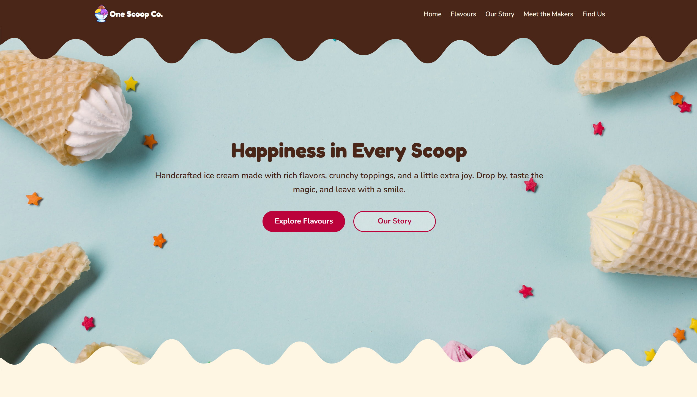

# One Scoop Co.



## Description

**One Scoop Co.** is a responsive mock ice cream shop website built with React. The project showcases a playful and modern user interface for an artisanal dessert brand, featuring flavour galleries, smooth animations, and responsive navigation.

The application was developed as part of a React front-end project and focuses on reusable components, responsive layouts, clean UI structure, and interactive user experiences.

## Features

- Responsive desktop-first design
- Interactive mobile navigation menu
- Dynamic gallery rendering using React props and `.map()`
- Smooth animations and transitions
- Semantic and accessible JSX structure
- Modern playful UI design
- State management for mobile menu toggle

## Technologies Used

### Front-End

- React
- CSS
- JavaScript
- NPM

### Tools Used

- VS Code
- Git
- GitHub

## Key Implementation Details

### Dynamic List Rendering

The flavour gallery is dynamically rendered using the JavaScript `.map()` method in React.

```jsx
  <section id="flavours" className="gallery">
    <div className="container gallery-container">
      <h2>Our Flavours</h2>
      <p>Every scoop is made with love and the freshest ingredients.</p>
      <ul className="gallery-list">
        {props.imageURLs.map((image) => (
          <li key={image.index}>
            <div className="image-container">
              
            </div>
            <div className="image-info">
              <p className="image-name">{image.name}</p>
              <p>Small • Medium • Large</p>
            </div>
          </li>
        ))}
      </ul>
    </div>
  </section>
```

## Demo

Click [here](https://fejiro001.github.io/components/) to demo
